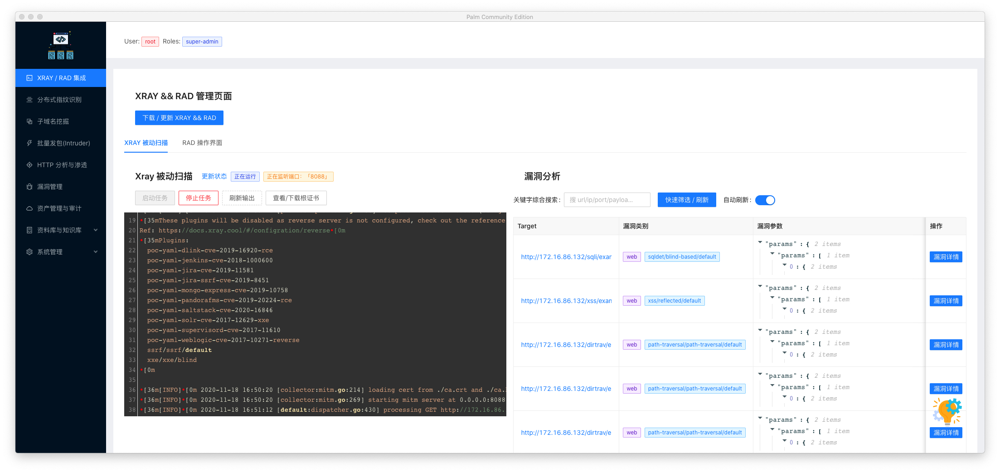

# palm-kit-desktop

[下载链接点击这里](https://github.com/VillanCh/palm-kit-desktop/releases/tag/0.1.0)

虽然阉割掉了一些功能, 但是仍然还是有很多功能给大家来玩~

## 功能

1. XRAY / RAD 基础集成
2. 分布式指纹识别(节点暂未开放下载 - 所以只能用本地节点了😄)
3. 子域名收集: 很简单的功能
4. 批量发包(类似 BurpSuite Intruder 玩法很多 - 大家玩得开心)
5. HTTP 分析与渗透: 对爬虫等收集到的资产进行分析和批量发包(类似 BurpSuite 的 Intruder)
6. 漏洞管理 / 资产审计 / 资料库 / 系统管理: 略

## 版本支持:

1. 暂时只支持 macos 版本
2. Windows 版本暂时没有经历适配, 如果想要可以来投喂我 :-)

## 外部依赖镜像 (Docker)

1. postgres:12
2. rabbitmq:3-management

## 使用步骤

1. 你有一台 mac, 下载本软件并安装
2. docker 环境配置正确
3. 执行 `docker pull postgres:12 && docker pull rabbitmq:3-management` 以安装必要的镜像

## 其他问题

1. XRAY && RAD 如果下载不到怎么办?

  `~/.palm-desktop` 是 palm-kit-desktop 的用户数据目录, 如果需要自己手动下载 xray / rad,  请放在 `~/.palm-desktop/` 下, 命名为 `xray_darwin_amd64` 和 `rad_darwin_amd64`

## 更多功能

大家可以在 issue 中许愿, 说不定下个版本就有了呢?
